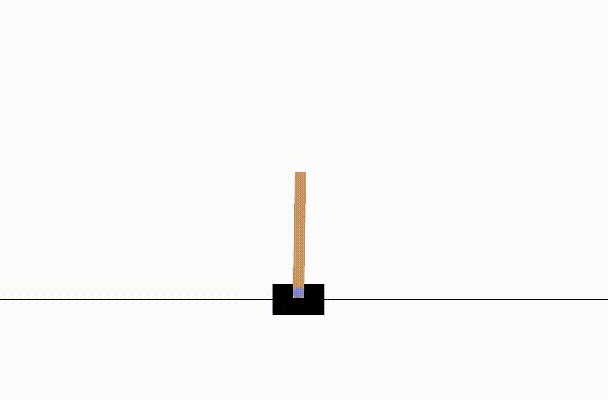

# 強化学習のチュートリアル
代表的な強化学習手法の実装を通して強化学習について学ぶためのレポジトリです。

## 目次
- [0_ConventionalAlgo](https://github.com/tech-tatsuma/RL_Tutorial/tree/master/0_ConventionalAlgo)
    - [Q-Learning](https://github.com/tech-tatsuma/RL_Tutorial/tree/master/0_ConventionalAlgo/Q-Learning)
    - [SARSA](https://github.com/tech-tatsuma/RL_Tutorial/tree/master/0_ConventionalAlgo/Sarsa)
- [1_DQN](https://github.com/tech-tatsuma/RL_Tutorial/tree/master/1_DQN)
- [2_PolicyGradient](https://github.com/tech-tatsuma/RL_Tutorial/tree/master/2_PolicyGradient)
- [3_ActorCritic](https://github.com/tech-tatsuma/RL_Tutorial/tree/master/3_ActorCritic)
- [4_A2C](https://github.com/tech-tatsuma/RL_Tutorial/tree/master/4_A2C)
- [5_DDPG](https://github.com/tech-tatsuma/RL_Tutorial/tree/master/5_DDPG)
- [6_PPO](https://github.com/tech-tatsuma/RL_Tutorial/tree/master/6_PPO)
- [7_SAC](https://github.com/tech-tatsuma/RL_Tutorial/tree/master/7_SAC)
- [8_TD3](https://github.com/tech-tatsuma/RL_Tutorial/tree/master/8_TD3)

---
### 0. 伝統的なアルゴリズム（ConventionalAlgo）
Q学習やSARSAなど、古典的な強化学習アルゴリズム。
- Q学習
    - 論文: Watkins, C. J. C. H., & Dayan, P. (1992). Q-learning. Machine Learning, 8(3-4), 279–292.
    - URL: https://link.springer.com/content/pdf/10.1007/BF00992698.pdf
- SARSA
    - 論文: Rummery, G. A., & Niranjan, M. (1994). On-line Q-learning using connectionist systems. Technical Report CUED/F-INFENG/TR 166, Cambridge University Engineering Department.
    - URL: https://www.researchgate.net/publication/220344150_Technical_Note_Q-Learning
### 1. Deep Q-Network(DQN)
ディープラーニングを用いたQ学習の拡張であるDQN。
- DQN
    - 論文: Mnih, V., Kavukcuoglu, K., Silver, D., et al. (2015). Human-level control through deep reinforcement learning. Nature, 518(7540), 529–533.
    - URL: https://www.nature.com/articles/nature14236
### 2. 方策勾配法(PolicyGradient)
方策を直接最適化する手法である方策勾配法。
- 方策勾配法
    - 論文: Sutton, R. S., McAllester, D. A., Singh, S. P., & Mansour, Y. (2000). Policy gradient methods for reinforcement learning with function approximation. In Advances in Neural Information Processing Systems (pp. 1057–1063).
    - URL: https://papers.nips.cc/paper/1713-policy-gradient-methods-for-reinforcement-learning-with-function-approximation.pdf
### 3. アクタークリティック(ActorCritic)
アクターとクリティックの２つのネットワークを用いた手法。
- アクタークリティック
    - 論文: Konda, V. R., & Tsitsiklis, J. N. (2000). Actor-Critic Algorithms. In Advances in Neural Information Processing Systems (pp. 1008–1014).
    - URL: https://proceedings.neurips.cc/paper/2000/file/1786-actor-critic-algorithms.pdf
### 4. Advantage Actor-Critic(A2C)
A2Cは、アクタークリティックの改良版であり、より安定した学習を可能にする。
- Advantage Actor-Critic
    - 論文: Mnih, V., Badia, A. P., Mirza, M., et al. (2016). Asynchronous methods for deep reinforcement learning. In Proceedings of the 33rd International Conference on Machine Learning (pp. 1928–1937).
    - URL: https://arxiv.org/abs/1602.01783
### 5. Deep Deterministic Polict Gradient(DDPG)
連続行動空間に対応したオフポリシー型の手法であるDDPGの実装例を含む。
- Deep Deterministic Policy Gradient 
    - 論文: Lillicrap, T. P., Hunt, J. J., Pritzel, A., et al. (2015). Continuous control with deep reinforcement learning.
    - URL: https://arxiv.org/abs/1509.02971
### 6. Proximal Policy Optimization(PPO)
PPOは、方策勾配法の一種であり、学習の安定性と効率性を兼ね備えた手法。
- Proximal Policy Optimization
    - 論文: Schulman, J., Wolski, F., Dhariwal, P., et al. (2017). Proximal Policy Optimization Algorithms.
    - URL: https://arxiv.org/abs/1707.06347
### 7. Soft Actor-Critic(SAC)
最大エントロピー強化学習の枠組みに基づく手法。
- Soft Actor-Critic (SAC)
    - 論文: Haarnoja, T., Zhou, A., Abbeel, P., & Levine, S. (2018). Soft Actor-Critic: Off-Policy Maximum Entropy Deep Reinforcement Learning with a Stochastic Actor.
    - URL: https://arxiv.org/abs/1801.01290
### 8. Twin Delayed DDPG(TD3)
DDPGの改良版。
- Twin Delayed DDPG
    - 論文: Fujimoto, S., Hoof, H., & Meger, D. (2018). Addressing Function Approximation Error in Actor-Critic Methods.
    - URL: https://arxiv.org/abs/1802.09477

## 作られる方策

  

    
    
CartPole

  

  

    
    
Pendulum

  

